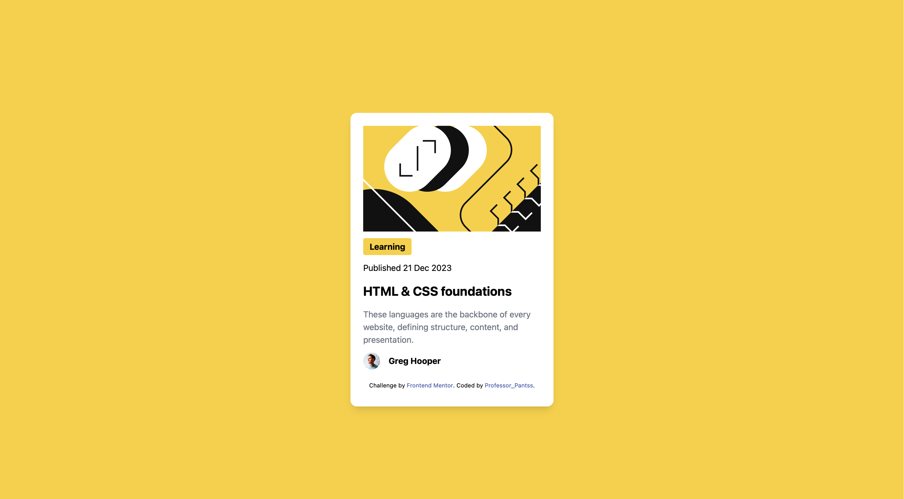

## Table of contents

- [Overview]
- [Screenshot]
- [Links]
- [My process]
- [Built with]
- [What I learned]
- [Continued development]

## Overview

### The challenge

Users should be able to:

- See hover and focus states for all interactive elements on the page

### Screenshot

### Links

- Solution URL:
- Live Site URL:

## My process

- The process for this challenge comprised of setting up tailwindcss and installing relevant packages.
- Tailwindcss was not required for this challenge, but I wanted to challenge myself at the same time learn a new technology.
- For the general layout, I used HTML to structure define appropriate divs.
- For the styling of the layout I used tailwindcss to apply styling to the elements inline.

### Built with

- Semantic HTML5 markup
- Flexbox
- Tailwindcss
- Desktop-first workflow

### What I learned

- Tailwindcss allows encapsulation through the use of @apply in custom css whenever the classes get tedious and repetetive.
- There isn't any need to restart the --watch process unless the tailwindcss.config.js file is changed.
- Applying and implementing custom colors in tailwindcss.config.js
- The relationship between parent and child components.

### Continued development

- Optimizing builds with purge in production.
- Customizing themes and extending tailwindcss.
- How to resolve conflicts between the local and remote branches.
- Why changes to tailwindcss styles require watching the CLI.
- The proper use of HTML semantics.
